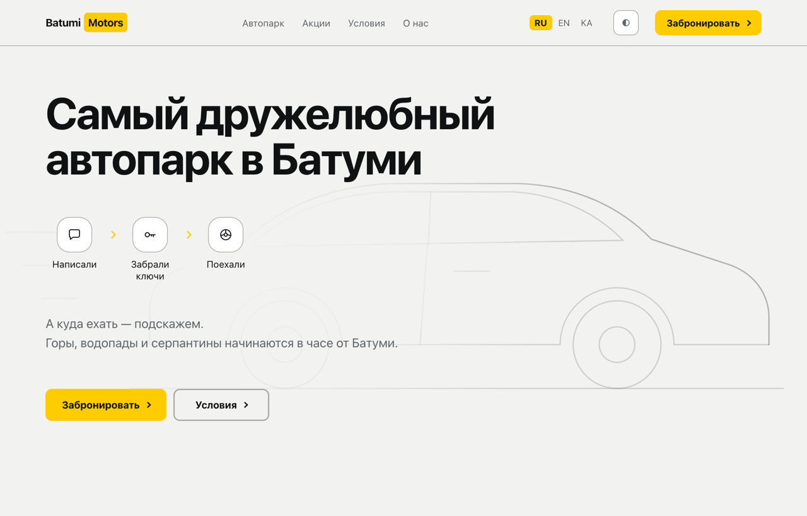
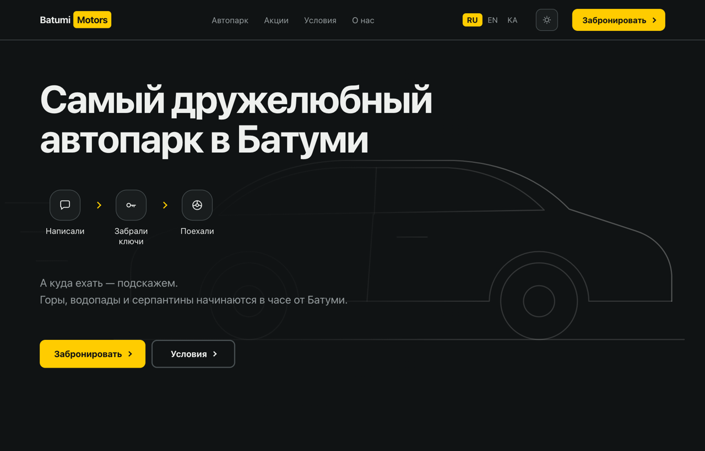

# Batumi Motors

A car rental site for Batumi. Three languages, data from a database, zero dependencies.



---

## What this is

A multilingual car rental site: the fleet, a page for every car with a price
calculator, seasonal deals, rental terms. Russian, English and Georgian are three
complete versions of the site — not a language switch layered over one set of words.

The fleet and the deals live in Supabase. Individual car pages **create and delete
themselves**: add a car to the database and its page appears in all three languages;
remove it and the page disappears, along with every link to it and its entry in the
sitemap.

What ships to the browser is still **plain static HTML**. All the text sits right
there in the markup — a search engine has nothing to execute.

---

## Highlights

**Zero dependencies.** `package.json` has no `dependencies` section at all — not one.
Node runs the TypeScript directly, with no compile step and no bundler. The entire
toolchain is six scripts and two libraries.

**A page weighs about 155 KB** all in — markup, styles, two fonts and scripts —
and that is *before* compression: on the host the stylesheet shrinks roughly fourfold.
First paint lands at 230–250 ms.

**Responsive photography.** Images come out of Supabase Storage sized for the screen
that asked for them, via `srcset`. Measured on a 1440 display at 2× density: photo
payload dropped from 774 KB to 158 KB, and decoding work fell by 72%.

**Accessibility by the numbers, not by eye.** Every text pair's contrast is computed
with the WCAG formula and holds level AA in both themes. Full keyboard navigation,
a visible focus ring, a correct heading hierarchy, and `prefers-reduced-motion`
honoured by every animation.

**Dark theme without the flash.** The stored choice is applied before the first paint,
so a dark page never flashes white on its way in.

**Three languages, honestly.** The key sets in the three dictionaries are checked
against each other automatically: 147 = 147 = 147. Georgian is handled down to the
details — a numeral there is always followed by the singular, and "from" is a suffix
rather than a word, which needs a template instead of string concatenation.

---

## How it looks

| Fleet | Car page |
|---|---|
|  |  |

Dark theme:



---

## How it works

Pages are assembled by substitution into marked regions. There are two kinds of
marker, and the distinction is not decoration — it is a separation of duties:

```html
<!--#header-->  ...  <!--#-->     ← from files: blocks, dictionaries, settings
<!--@cars-->    ...  <!--@-->     ← from the database: cars, deals
```

Each script fills only its own markers and leaves everyone else's alone. That is why
the same page can be processed by different scripts safely, in any order.

| Script | What it does |
|---|---|
| `update.ts` | distributes what lives in files: header, footer, dictionaries, language links |
| `cars.ts` | the grid of car cards, from the database |
| `car-pages.ts` | creates and deletes the page for each individual car |
| `deals.ts` | the deals |
| `sitemap.ts` | the sitemap and `robots.txt`, by walking the finished folder |
| `server.ts` | a local server plus a database watcher, for working at your desk |

`server.ts` is never deployed. It exists so you can see your edits immediately, and it
deliberately forbids the browser to cache pages.

---

## Running it

```bash
npm start      # server on localhost:4444 + database watcher
npm run build  # rebuild every page from the database and the files
```

Requires Node 24 or newer — that is where TypeScript runs without a compile step.

---

## Layout

```
├── blocks/          header, footer, <head> — markup shared by every page
├── lib/             dictionaries, database access, marker substitution, pricing
├── scripts/         the build commands
├── templates/       the car page template
├── text/            translatable text: ru, en, ka
├── data.txt         phone number, domain, database access
└── www/             what goes to the host
    ├── ru/ en/ ka/  16 pages per language
    └── assets/      styles, fonts, three scripts
```

---

## About the key in `data.txt`

It is in the repository on purpose. This is Supabase's **publishable** key — the one
designed to end up in the browser; access to the data is restricted by policies on the
database side, not by keeping the key secret. Verified: without it the table answers
`401`, and with it the table returns only the rows flagged as visible.

There is no secret key in this project at all. It isn't needed — the site only reads.

---

## Font licenses

Nunito and Noto Sans Georgian are licensed under the SIL Open Font License; the license
text sits next to the font files.
